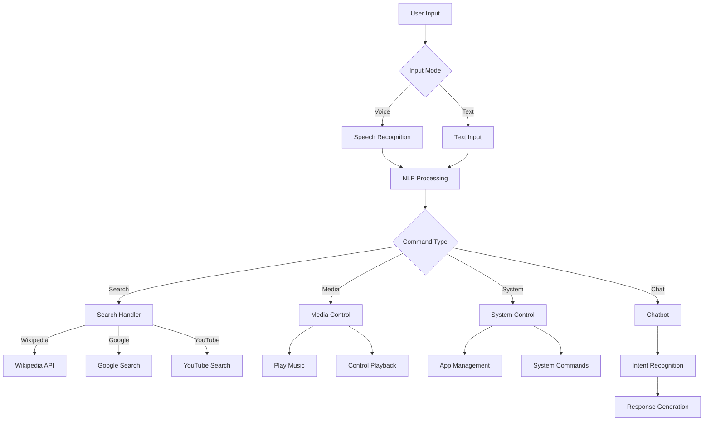

# Sage AI Assistant

A sophisticated AI assistant that combines voice interaction, natural language processing, and multiple service integrations to provide a seamless user experience.



## System Architecture

### 1. Core Components

#### Input Processing
- **Speech Recognition (STT)**
  - Uses Google's Speech Recognition API
  - Optimized settings for better accuracy:
    - Dynamic energy adjustment (damping: 0.3)
    - Energy ratio: 0.9
    - Pause threshold: 0.5s
    - Non-speaking duration: 0.5s

- **Text-to-Speech (TTS)**
  - Uses pyttsx3 engine
  - Female voice for better clarity
  - Optimized speech rate (125 WPM)
  - Error handling with text fallback

#### Command Processing
- **NLP Processor**
  - NLTK integration for text analysis
  - Part-of-speech tagging
  - Entity recognition
  - Command pattern matching

### 2. Features and Capabilities

#### Search Functions
- Wikipedia searches with fallback to Google
- YouTube video search and playback
- Google web search integration

#### Media Control
- Music playback via YouTube
- Basic media controls (play, pause, next, previous)
- Volume control

#### System Control
- Application management (open/close)
- System commands support
- Error handling and feedback

#### Chat Interface
- Intent-based response system
- Natural language understanding
- Contextual responses

### 3. Dependencies
```
- speech_recognition
- pyttsx3
- nltk
- wikipedia
- pywhatkit
- pyautogui
```

### 4. Mode Selection
1. **Text Mode (1)**
   - Direct text input
   - Suitable for quiet environments
   - More precise command input

2. **Voice Mode (2)**
   - Hands-free operation
   - Natural speech interaction
   - Real-time feedback

### 5. Command Structure
```
[wake word] <command> [parameters]
Example: "sage play music shape of you"
```

### 6. Error Handling
- Graceful fallbacks for failed voice recognition
- Alternative search paths for information requests
- Clear user feedback for all operations

### 7. Future Improvements
- Enhanced media control integration
- Expanded system command support
- More natural conversation flow
- Custom wake word support
- Multi-language support

## Usage Examples

1. **Search Operations**
   ```
   "search in google about weather"
   "wikipedia artificial intelligence"
   "search in youtube new songs"
   ```

2. **Media Control**
   ```
   "play song shape of you"
   "pause"
   "next"
   "previous"
   ```

3. **System Control**
   ```
   "open spotify"
   "close spotify"
   "what time is it"
   ```

4. **General Queries**
   ```
   "who is Albert Einstein"
   "what is quantum physics"
   "tell me about AI"
   ```
