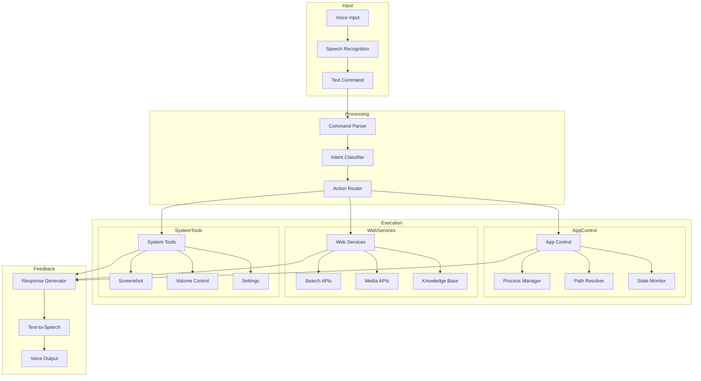
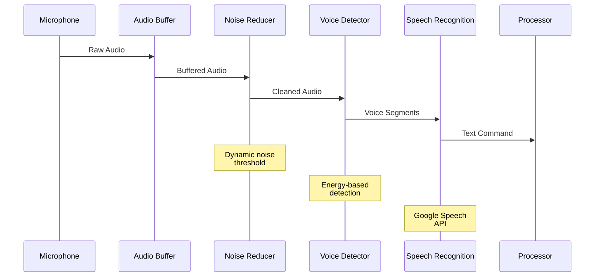
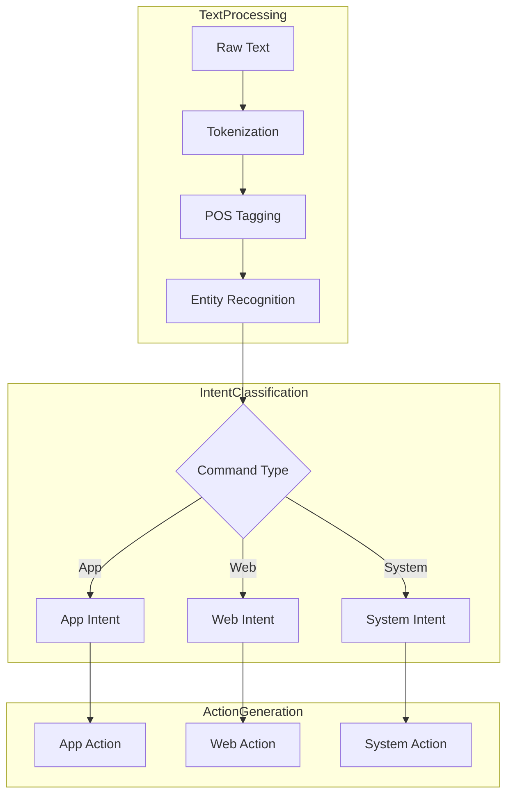
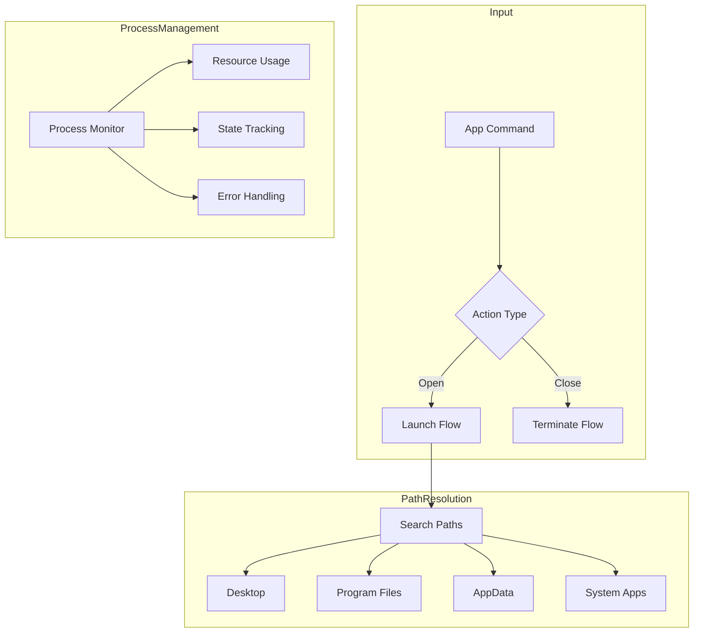
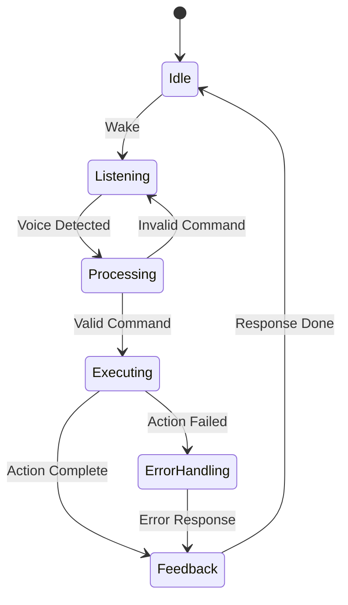
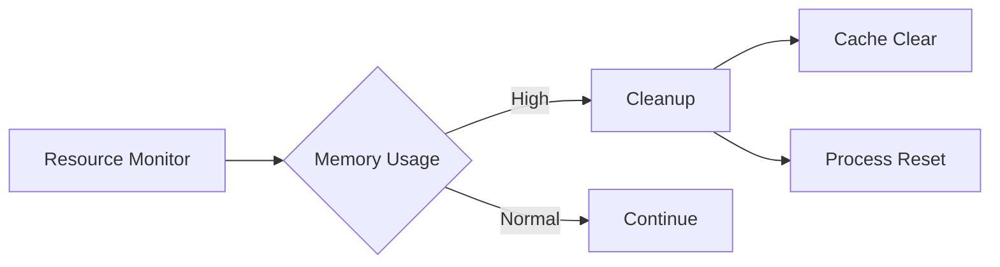
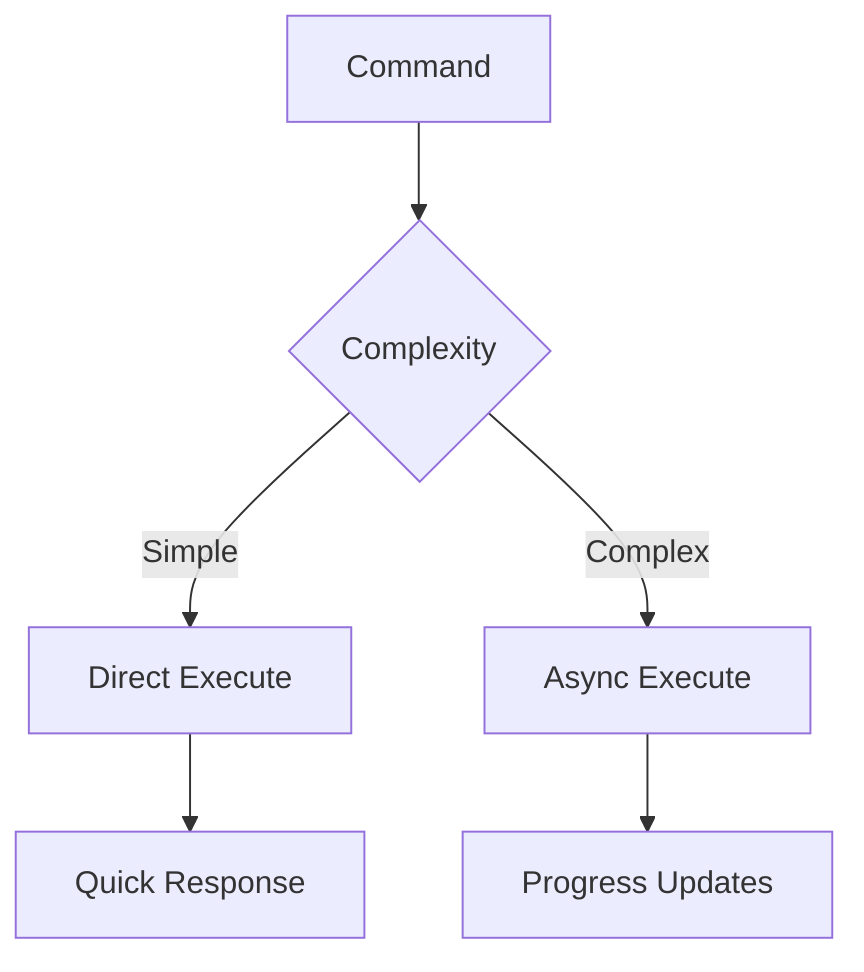

# 🎙️ Sage AI Voice Assistant

An advanced voice-controlled AI assistant that seamlessly integrates with your Windows system to provide comprehensive control over applications, web services, and system functions.

<div align="center">


</div>

## 📋 Table of Contents
- [Features](#-features)
- [Technical Architecture](#-technical-architecture)
- [Installation](#-installation)
- [Usage Guide](#-usage-guide)
- [System Components](#-system-components)
- [Error Handling](#-error-handling)
- [Performance](#-performance)
- [Contributing](#-contributing)
- [Support](#-support)

## 🌟 Features

### Voice Control System
- Real-time speech recognition with noise cancellation
- Natural text-to-speech responses
- Continuous listening mode
- Multi-command processing

### Application Management
- **Desktop Apps**: Launch and terminate applications
- **Web Services**: Quick access to online platforms
- **System Tools**: Windows settings and utilities
- **Process Control**: Application lifecycle management

### Smart Integration
- YouTube search and playback
- Google web searches
- Wikipedia knowledge base
- Weather information

## 🔧 Technical Architecture

### System Overview


### Detailed Component Analysis

#### 1. Speech Recognition Pipeline


#### 2. Command Processing Flow


#### 3. Application Control Architecture


### Detailed Component Specifications

#### Speech Recognition Engine
```python
class SpeechEngine:
    """
    Core Components:
    1. AudioInput:
       - Sample Rate: 16000Hz
       - Bit Depth: 16-bit
       - Channels: Mono
    
    2. NoiseReducer:
       - Algorithm: Spectral Subtraction
       - Window Size: 25ms
       - Step Size: 10ms
    
    3. VoiceDetector:
       - Type: Energy-based VAD
       - Threshold: Dynamic
       - Min Duration: 0.5s
    
    4. SpeechRecognizer:
       - Engine: Google Speech API
       - Language: en-US
       - Timeout: 5s
    """
```

#### Command Processor
```python
class CommandProcessor:
    """
    Processing Steps:
    1. Text Normalization:
       - Case normalization
       - Punctuation removal
       - Special character handling
    
    2. Intent Classification:
       - Pattern matching
       - Keyword extraction
       - Context analysis
    
    3. Action Generation:
       - Command validation
       - Parameter extraction
       - Action mapping
    
    4. Error Handling:
       - Invalid commands
       - Missing parameters
       - Execution failures
    """
```

### System States and Transitions



### Performance Optimization

#### Memory Management


#### Response Time Optimization


## 📥 Installation

### System Requirements
- Python 3.8 or higher
- Windows 10/11
- Microphone
- Internet connection

### Quick Start
1. Clone the repository:
```bash
git clone https://github.com/yourusername/sage-assistant.git
cd sage-assistant
```

2. Install dependencies:
```bash
pip install -r requirements.txt
```

### Dependencies
```plaintext
speech_recognition>=3.8.1
pyttsx3>=2.90
pywhatkit>=5.3
wikipedia>=1.4.0
pyautogui>=0.9.53
nltk>=3.6.5
```

## 🎯 Usage Guide

### Launch
```bash
python sage.py
```

### Voice Commands

#### Application Control
```plaintext
"open [app_name]"         # Launch application
"close [app_name]"        # Close application
"switch to [app_name]"    # Focus application
```

#### Web Operations
```plaintext
"search for [query]"      # Google search
"play [song_name]"        # YouTube playback
"who is [person]"         # Wikipedia search
"weather in [city]"       # Weather info
```

#### System Operations
```plaintext
"take screenshot"         # Capture screen
"open settings"          # System settings
"volume [up/down]"       # Audio control
```

## 🔍 System Components

### Speech Recognition Engine
```python
class SpeechEngine:
    """
    Core functionality:
    - Microphone input processing
    - Noise reduction
    - Speech-to-text conversion
    - Error handling
    """
```

### Command Processor
```python
class CommandProcessor:
    """
    Features:
    - Intent classification
    - Natural language parsing
    - Action routing
    - Response generation
    """
```

### Application Controller
```python
class AppController:
    """
    Capabilities:
    - Process management
    - Path resolution
    - Launch/terminate apps
    - State monitoring
    """
```

## ⚡ Performance

### Response Times
- Voice Recognition: <1s
- Command Processing: <100ms
- App Launch: <2s
- Web Operations: <3s

### Resource Usage
- Memory: ~100MB
- CPU: 5-10%
- Network: As needed
- Storage: Minimal

## 🛠️ Error Handling

### Speech Recognition
- Ambient noise adjustment
- Timeout handling
- Recognition error recovery
- Network failure handling

### Application Control
- Process verification
- Permission management
- Resource monitoring
- Graceful degradation

### System Integration
- Path validation
- API error handling
- Resource cleanup
- State recovery

## 🔄 Development

### Current Focus
- Enhanced voice recognition
- Expanded app support
- Improved error handling
- Better user feedback

### Future Roadmap
1. Multi-language support
2. Custom wake words
3. User profiles
4. Task automation
5. Context awareness

## 👥 Contributing

1. Fork the repository
2. Create a feature branch
3. Commit changes
4. Push to branch
5. Create Pull Request

## 📄 License

This project is licensed under the MIT License - see the [LICENSE](LICENSE) file for details.

## 🙏 Acknowledgments

- Speech recognition powered by Google
- NLP capabilities by NLTK
- Web integration via PyWhatKit

## 💬 Support

### Get Help
- [Open an Issue](https://github.com/yourusername/sage-assistant/issues)
- Check the [FAQ](docs/FAQ.md)
- [Contact Maintainers](mailto:support@sage-assistant.com)

### Common Issues
1. Speech Recognition
   - Check microphone connection
   - Adjust system audio settings
   - Ensure quiet environment

2. Application Control
   - Verify app installation
   - Check file permissions
   - Update path configurations

---
<div align="center">
Last updated: January 2025

Made with ❤️ by the Sage AI Team
</div>
